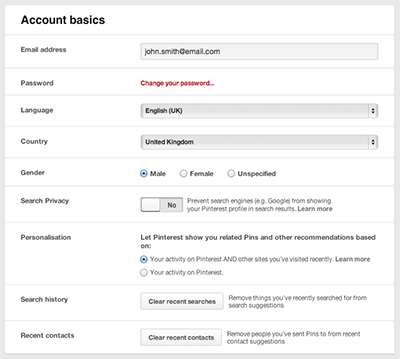

# Forms

Most websites have several pages with form layouts. You can find them in account settings, payment flows, feedback forms, surveys, and more. Getting the html right makes styling these pages a breeze.



## Form container

TODO

```html
<form>
	<p>Please complete the form below. Mandatory fields are marked <em>*</em></p>
	<fieldset>
		<legend>Your details</legend>
		[...]
	</fieldset>
	<fieldset>
		<legend>Billing address</legend>
		[...]
	</fieldset>
	<p><button type="submit">Submit</button></p>
</form>
```

## Grouping form items

We need to display a list of form elements to the user in a logical order. When we think of it in these terms, an ordered list makes most sense. 

Definition lists are often recommended in this situation, but what they lack is a way of grouping labels and inputs together. An ordered list gives you that, and is much more useful when it comes to styling.

```html
<!-- basic layout -->
<fieldset>
	<legend>Your details</legend>
	<ol>
		<li>
        	[...form select dropdown...]
		</li>
		<li>
        	[...form text input...]
		</li>
	</ol>
</fieldset>

<!-- advanced layout -->
<fieldset>
    <legend>Your details</legend>
    <ol class="form_items">
        <li class="form_item form_item--select">
        	[...form select dropdown...]
        </li>
        <li class="form_item form_item--text">
        	[...form text input...]
        </li>
    </ol>
</fieldset>
```


## Form items

This covers form items which have a single form input element.
Eg. text, password, select, textarea, checkbox

```html
<!-- basic layout -->
<li>
    <label for="firstName">First name <em>*</em></label>
    <input id="firstName" type="text" required>
</li>

<!-- advanced layout -->
<li class="form_item">
    <div class="form_item_label">
        <label for="firstName">First name <em>*</em></label>
    </div>
    <div class="form_item_field">
        <input class="form" id="firstName" type="text" required>
        <span class="form_item_icon">!</span>
        <span class="form_item_hint">Enter your name</span>
        <span class="form_item_warning">Invalid name</span>
    </div>
</li>
```


## Form item groups

This covers form items which have a multiple form input elements.
Eg. radio buttons, checkboxes, and in some cases, select dropdowns.

```html
<!-- basic layout -->
<li>
	<fieldset>
		<legend>Subscribe to our newsletter?</legend>
		<label><input type="radio" name="newsletter"> Yes</label>
		<label><input type="radio" name="newsletter"> No</label>
	</fieldset>
</li>

<!-- advanced layout -->
<li class="form_item_group">
	<fieldset>
		<legend>Subscribe to our newsletter?</legend>
		<div class="form_item">
			<label>
				<input type="radio" name="newsletter"> Yes
			</label>
		</div>
		<div class="form_item">
			<label class="form_item_label">
				<input type="radio" name="newsletter"> No
			</label>
		</div>
	</fieldset>
</li>
```


To achieve your design, you may need extra elements to hold other information. Or you may need to group things together or reorder them

```html
<fieldset>
  <legend>Your details</legend>
  <ol>
    <li>
      <label for="firstName">First name <em>*</em></label>
      <input id="firstName" type="text" placeholder="eg. John" required>
      <span class="hint">It's what your mum calls you</span>
      <span class="warning">You must have a first name to continue</span>
    </li>
  </ol>
</fieldset>
```


```html
<fieldset>
  <legend>Your details</legend>
  <ol>
    <li>
      <label for="firstName">First name <em>*</em></label>
      <input id="firstName" type="text">
      <span class="hint">Enter your first name</span>
    </li>
    <li>
      <label for="middleName">Middle name</label>
      <input id="middleName" type="text">
      <span class="hint"></span>
    </li>
    <li>
      <label for="lastName">Last name <em>*</em></label>
      <input id="lastName" type="text">
      <span class="hint">Enter your last name</span>
    </li>
  </ol>
</fieldset>
```

```html
<form>
  <p>Please complete the form below. Mandatory fields marked <em>*</em></p>
  <fieldset>
    <legend>Delivery Details</legend>
    <ol>
      <li>
        <label for="name">Name <em>*</em></label>
        <input id="name">
      </li>
      <li>
        <label for="address1">Address <em>*</em></label>
        <input id="address1">
      </li>
      <li>
        <label for="town-city">Town/City</label>
        <input id="town-city">
      </li>
      <li>
        <label for="county">County <em>*</em></label>
        <input id="county">
      </li>
      <li>
        <label for="postcode">Postcode <em>*</em></label>
        <input id="postcode">
      </li>
      <li>
        <fieldset>
          <legend>Is this address also your invoice address? <em>*</em></legend>
          <label><input type="radio" name="invoice-address"> Yes</label>
          <label><input type="radio" name="invoice-address"> No</label>
        </fieldset>
      </li>
    </ol>
  </fieldset>
  <fieldset>
    <legend>Other Information</legend>
    <ol>
      <li>
        <label for="dob">Date of Birth <span class="hidden">(Day)</span> <em>*</em></label>
        <select id="dob">
          <option value="1">1</option>
          <option value="2">2</option>
        </select>
        <label for="dob-m" class="hidden">Date of Birth (Month) <em>*</em></label> 
        <select id="dob-m">
          <option value="1">Jan</option>
          <option value="2">Feb</option>
        </select>
        <label for="dob-y" class="hidden">Date of Birth (Year) <em>*</em></label> 
        <select id="dob-y">
          <option value="1979">1979</option>
          <option value="1980">1980</option>
        </select>
      </li>
      <li>
        <label for="sex">Sex <em>*</em></label> 
        <select id="sex">
          <option value="female">Female</option>
          <option value="male">Male</option>
        </select>
      </li>
      <li>
        <fieldset>
          <legend>Which of the following sports do you enjoy?</legend>
          <label for="football"><input id="football" type="checkbox"> Football</label>
          <label for="golf"><input id="golf" type="checkbox"> Golf</label>
          <label for="rugby"><input id="rugby" type="checkbox"> Rugby</label>
          <label for="tennis"><input id="tennis" type="checkbox"> Tennis</label>
          <label for="basketball"><input id="basketball" type="checkbox"> Basketball</label>
          <label for="boxing"><input id="boxing" type="checkbox"> Boxing</label>
        </fieldset>
      </li>
      <li>
        <label for="comments">Comments</label>
        <textarea id="comments" rows="7" cols="25"></textarea>
      </li>
    </ol>
  </fieldset>
  <p><input type="submit" value="Submit order"></p>
</form>
```

**Ordered List**

This is the preferred markup style. It uses an ordered list to group each field. Within the list item is the label, the form field, and any other related markup like hints and feedback.

Source: http://alistapart.com/article/prettyaccessibleforms


## Summary view

Sometimes you need to display the form values in a static view. For example, when a user submits payment details they may be shown a summarised, un-editable view of the same details before being asked to confirm the order. If the design is the same as the form view likely to be the same but with the form elements being replaced by inline text.

You could mark this up by replacing the form elements with a class structure.

```html
<form class="form">
  <div class="formFieldset">
    <div class="formLegend">Delivery Details</div>
    <ol>
      
      <!-- basic form item -->
      <li>
        <label for="firstName">First name <em>*</em></label>
        <input id="firstName" type="text" required>
        <div class="warning"></div>
      </li>
      
      <!-- text input -->
      <div class="formItem">
        <div class="formLabel">
          <label for="firstName">First name <em>*</em></label>
        </div>
        <div class="formField">
          <input class="form" id="firstName" type="text" required>
          <div class="formItemFeedback"></div>
        </div>
      </div>
      
      
      <li>
        <div class="formLabel">Address</div>
        <div class="formField">58 Old Street</div>
      </li>
      <li>
        <div class="formLabel">Town/City</div>
        <div class="formField">Shoreditch</div>
      </li>
      <li>
        <div class="formLabel">County</div>
        <div class="formField">London</div>
      </li>
      <li>
        <div class="formLabel">Postcode</div>
        <div class="formField">E1 7RT</div>
      </li>
    </ol>
  </div>
  <div class="form-fieldset">
    <div class="form-legend">Billing Details</div>
    <ol>
      <li>
        <div class="form-label">Name</div>
        <div class="form-field">John Smith</div>
      </li>
      <li>
        <div class="form-label">Address</div>
        <div class="form-field">58 Old Street</div>
      </li>
      <li>
        <div class="form-label">Town/City</div>
        <div class="form-field">Shoreditch</div>
      </li>
      <li>
        <div class="form-label">County</div>
        <div class="form-field">London</div>
      </li>
      <li>
        <div class="form-label">Postcode</div>
        <div class="form-field">E1 7RT</div>
      </li>
    </ol>
  </div>
  <div class="form-fieldset">
    <div class="form-legend">Other Information</div>
    <ol>
      <li>
        <div class="form-label">Date of Birth</div>
        <div class="form-field">16 Sep 1984</div>
      </li>
      <li>
        <div class="form-label">Sex</div>
        <div class="form-field">Male</div>
      </li>
      <li>
        <div class="form-label">Which of the following sports do you enjoy?</div>
        <div class="form-field">Football, Golf, Tennis</div>
      </li>
      <li>
        <div class="form-label">Comments</div>
        <div class="form-field">Lorem ipsum dolor sit amet...</div>
      </li>
    </ol>
  </div>
  <p><input type="submit" value="Confirm order"></p>
</form>
```

